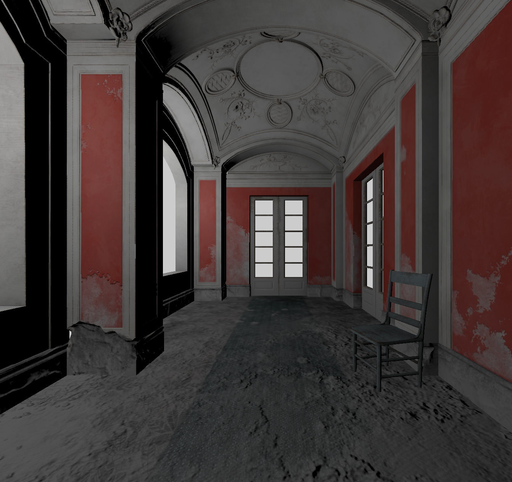

# Nasral Engine

3D/2D game engine written in C++ with a focus on modern rendering techniques and efficient data management.

> **Note**: This project is currently in active development. Many features are experimental or in progress.

### Key Features

#### 🚀 Rendering (Vulkan)
Modern rendering pipeline powered by Vulkan with a focus on performance and scalability:
- **Global Storage Buffers**: All scene objects are managed through global storage buffers to minimize state changes.
- **Index Pools**: Efficient management of scene object indices.
- **Bindless Descriptors**: Utilizes bindless design for flexible management of large scenes and simplified integration of Ray Tracing.

#### 🏗️ Architecture (Archetype-based ECS)
Performance-oriented Entity Component System:
- **Archetype-based**: Components are stored in contiguous memory blocks based on their combinations.
- **Cache-Efficiency**: Optimized for sequential access to minimize cache misses.
- **No Virtual Polymorphism**: Avoids virtual function calls in "hot" loops for maximum execution speed.

#### 📦 Resource Management
Robust system for handling engine assets:
- **Asynchronous Loading**: Resource loading is performed in background threads to prevent frame stuttering.
- **Single-Threaded Readiness Handling**: Thread-safe synchronization of loaded resources back to the main engine state.
- **Scene Loading**: Automatic instantiation of entities and components from scene files.

#### ⚙️ Core Subsystems
- **Event System**: Decoupled communication between engine subsystems using a flexible event registration and dispatch mechanism.
- **Input Management**: Comprehensive handling of user input (keyboard, mouse).
- **Scene Management**: Hierarchical scene graph and entity lifecycle management.
- **Logging**: Detailed diagnostic output for debugging and performance monitoring.

### Technical Stack
- **Language**: C++17
- **Graphics API**: Vulkan
- **Math**: GLM
- **Build System**: CMake