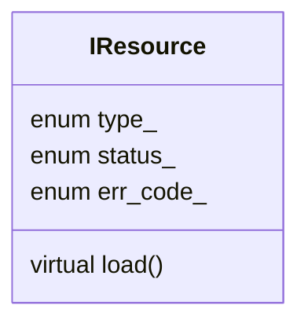
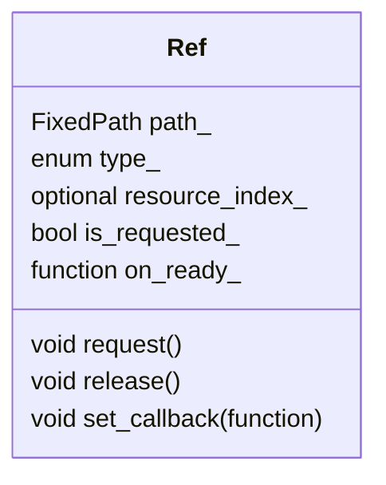
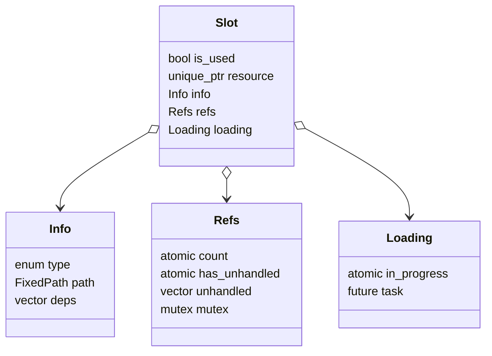

# Система управления ресурсами

## Ресурс

Все типы ресурсов (файл, текстура, меш, шейдер, материал и т.д.) наследуются от базового класса (интерфейса) `IResource`.

Поля:
- `type_`: тип ресурса (например, `eFile`, `eTexture`, `eMaterial`).
- `status_`: состояние ресурса (`eUnloaded`, `eLoaded`, `eError`).
- `err_code_`: код ошибки, если загрузка не удалась.

Методы:
- `load()`: чисто виртуальный метод загрузки ресурса. Реализуется в классах-наследниках.

## Держатель (обработчик) ресурса

Для работы с ресурсом используется класс `Ref`. Любой объект (например, узел сцены), которому нужен ресурс, должен владеть экземпляром этого класса.

Поля:
- `path_`: путь к файлу ресурса (`FixedPath`).
- `type_`: тип ресурса (используется для идентификации ресурса).
- `resource_index_`: индекс ресурса в списке менеджера (опционально).
- `is_requested_`: флаг, указывающий, запрошен ли ресурс.
- `on_ready_`: функция обратного вызова, вызываемая при готовности ресурса.

Методы:
- `request()`: запрашивает ресурс через менеджер.
- `release()`: освобождает ссылку на ресурс.
- `set_callback(function)`: устанавливает функцию обратного вызова, срабатывающую при готовности ресурса.

## Информация о ресурсе

Класс `ResourceManager` содержит массив `slots_` с информацией о ресурсах. Каждый элемент массива — структура `Slot`, которая хранит данные о ресурсе и его состоянии.

Поля структуры `Slot`:
- `is_used`: флаг, указывающий, используется ли слот.
- `resource`: указатель на ресурс (`std::unique_ptr<IResource>`).
- `info`: подструктура с информацией о ресурсе:
  - `type`: тип ресурса (`eFile`, `eTexture`, `eMaterial` и т.д.).
  - `path`: путь к файлу ресурса (`FixedPath`).
  - `deps`: список путей к файлам-зависимостям (например, текстуры и шейдеры для материала).
- `refs`: подструктура для управления ссылками:
  - `count`: атомарный счётчик ссылок на ресурс (`std::atomic<size_t>`).
  - `has_unhandled`: атомарный флаг, указывающий, есть ли необработанные запросы (`std::atomic<bool>`).
  - `unhandled`: список необработанных объектов `Ref` (`std::vector<Ref*>`).
  - `mutex`: мьютекс для защиты списка `unhandled` (`std::mutex`).
- `loading`: подструктура для управления загрузкой:
  - `in_progress`: атомарный флаг, указывающий, выполняется ли загрузка (`std::atomic<bool>`).
  - `task`: асинхронная задача загрузки ресурса (`std::future<void>`).

## Менеджер ресурсов

Класс `ResourceManager` управляет всей подсистемой ресурсов. Он обеспечивает потокобезопасный запрос и освобождение ресурсов, а также их загрузку и выгрузку.

Поля:
- `slots_`: массив структур `Slot` для хранения информации о ресурсах.
- `free_slots_`: список индексов свободных слотов (`std::vector<size_t>`).
- `indices_`: ассоциативный массив, связывающий путь к файлу (`std::string_view`) с индексом в `slots_` (`std::unordered_map<std::string_view, size_t>`).

Методы:
- `add_unsafe(type, path)`: добавляет информацию о ресурсе в `slots_` и `indices_`. Вызывается для инициализации списка ресурсов перед их использованием (например, при загрузке сцены).
- `remove_unsafe(path)`: удаляет информацию о ресурсе из `slots_` и `indices_`. Ожидает завершения всех задач загрузки.
- `remove_all_unsafe()`: очищает все слоты и связанные данные.
- `request(ref, unsafe)`: запрашивает ресурс через объект `Ref`. Увеличивает атомарный счётчик `refs.count`, добавляет `Ref*` в список `refs.unhandled` (с мьютексом в потокобезопасном режиме) и устанавливает флаг `refs.has_unhandled`. Параметр `unsafe` определяет, использовать ли мьютекс.
- `release(ref, unsafe)`: освобождает ссылку на ресурс. Уменьшает `refs.count`, удаляет `Ref*` из `refs.unhandled` (с мьютексом в потокобезопасном режиме) и обновляет `refs.has_unhandled`.
- `update(delta)`: итерирует по всем используемым слотам (`is_used == true`) и выполняет следующие действия:
  - Если ресурс загружен (`status_ != eUnloaded`) и есть необработанные запросы (`refs.has_unhandled == true`), вызывает функции обратного вызова `on_ready` для всех `Ref` в `refs.unhandled` и очищает список.
  - Если есть активные ссылки (`refs.count > 0`), ресурс не создан и не загружается (`!resource && !loading.in_progress`), создаёт объект ресурса и запускает асинхронную задачу загрузки через `std::async`.
  - Если ссылок нет (`refs.count == 0`) и ресурс существует, выгружает его (`resource.reset()`).
- `await_all_tasks()`: ожидает завершения всех задач загрузки.

## Общая схема работы

- Список ресурсов (`slots_`) инициализируется через `add_unsafe` до начала запросов (например, при загрузке сцены). Это создаёт все необходимые слоты с информацией о типе, пути и зависимостях.
- Узлы сцены или другие объекты, которым нужны ресурсы, создают объекты `Ref`, содержащие путь к ресурсу, тип и функцию обратного вызова (`on_ready_`).
- Запрос ресурса выполняется через `request(ref)`, который увеличивает счётчик ссылок и добавляет `Ref` в список необработанных запросов. Метод потокобезопасен, если `unsafe = false`.
- Освобождение ресурса выполняется через `release(ref)`, уменьшая счётчик ссылок и удаляя `Ref` из списка необработанных запросов. Также потокобезопасен при `unsafe = false`.
- В методе `update`, вызываемом в конце каждой итерации основного цикла, происходят:
  - Вызов функций `on_ready_` для загруженных ресурсов с необработанными запросами.
  - Инициирование асинхронной загрузки для запрошенных, но ещё не созданных ресурсов.
  - Выгрузка ресурсов, на которые больше нет ссылок.
- Зависимости ресурсов (указанные в `info.deps`) могут запрашиваться в конструкторе ресурса (например, для `eMaterial`), но эта функциональность пока не реализована.