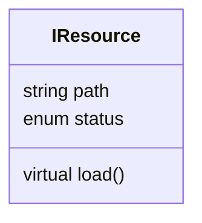
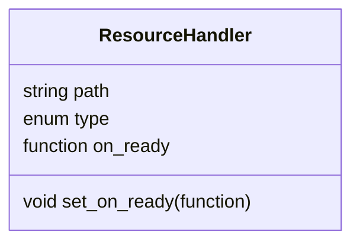
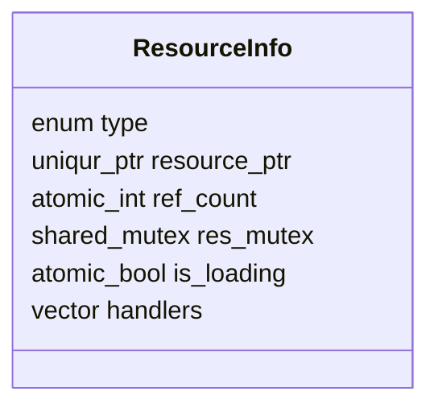

# Система управления ресурсами

## Ресурс

Все типы ресурсов (текстура, меш, шейдер и т.д.) наследуются от базового класса (интерфейса) `IResource`.

Поля:
- `path` : путь к файлу
- `status`: состояние ресурса (не загружен, загружен, ошибка)

Методы:
- `load` : полностью виртуальный метод загрузки ресурса. Реализуется в классах наследниках.

## Держатель (обработчик) ресурса

Для корректной работы с ресурсом нужно создать объект класса `ResourceHandler`. Любой объект (например, узел сцены) которому нужен ресурс должен владеть таким объектом.

Поля:
- `path` : путь к файлу ресурса
- `type` : тип ресурса (может быть нужен для визуального отображения полей или аналогичных целей)
- `on_ready` : лямбда функция готовности ресурса

Методы:
- `set_on_ready(function)` установить функцию обратного вызова которая будет срабатывать в момент когда ресурс становится доступен

## Информация о ресурсе

Класс менеджера ресурсов (`ResourceManager`) в себе содержит ассоциативный массив всех ресурсов. Ключом в данном массиве является строка (путь к файлу), а значением - структура `ResourceInfo`.

Поля:
- `type` : тип ресурса, помогает понять какой объект нужно конструировать при загрузке ресурса
- `resource_ptr` : указатель на ресурс, по умолчанию пустой.
- `ref_count` : атомарный счетчик ссылок на ресурс
- `res_mutex` : мьютекс для изменения указателя на ресурс (во время загрузки или выгрузки ресурса)
- `is_loading` : находится ли ресурс в процессе загрузки
- `handlers` : список не обработанных хендлеров которые ссылаются на ресурс

## Менеджер ресурсов

Для управления всей подсистемой ресурсов есть класс `ResourceManager`. При помощи его можно запрашивать ресурсы, освобождать не нужные ресурсы, добавлять ресурсы в список для дальнейшего запроса. Менеджер отслеживает ссылки на ресурсы, управляет загрузкой и выгрузкой.

Поля:
- `resource_list` : список всех ресурсов. Каждый элемент - структура `ResourceInfo`.
- `resource_map` : ассоциативный массив вида "строка" -> "индекс". Обеспечивает быстрый доступ к ресурсу по пути к файлу.

Методы:
- `add(path, type)` : метод добавления информации о ресурсе в список `resource_list` и ассоциативного контейнера `resource_map` (для быстрого доступа). Обычно список должен быть полностью сформирован до того как ресурсы будут запрашиваться (например, при инициализации сцены, до её обработки и рендеринга).
- `remove(path)` : метод удаления информации о ресурсе из списка `resource_list` и ассоциативного контейнера `resource_map`.
- `request(resource_handler)` : метод запроса ресурса, принимает указатель на объект `ResourceHandler`. В результате вызова увеличивает атомарный счетчик ссылок у нужного объекта `ResourceInfo` в контейнере `resource_list`, а также добавляет указатель из аргумента в список `handlers` у этого же объекта.
- `release(resource_handler)` : метод освобождения ресурса, принимает указатель на объект `ResourceHandler`. В результате вызова увеличивает атомарный счетчик ссылок у нужного объекта `ResourceInfo` в контейнере `resource_list`, а также удаляет указатель из списка `handlers` если такой указатель еще там есть (например, не был обработан).
- `update()` : метод, в котором осуществляется итерация по всем ресурсам. Для ресурсов у которых:
  - кол-во ссылок `ref_count` положительное, при этом указатель на ресурс пуст, и переменная `is_loading` равна false - запускается поток загрузки ресурса, и переменная `is_loading` устанавливается в true. После того как в отдельном потоке ресурс уже загружен, захватывается мьютекс `res_mutex` и ресурс устанавливается в `resource_ptr`, а переменная `is_loading` устанавливается в false.
  - кол-во ссылок `ref_count` положительное, при этом указатель на ресурс не пуст, запускается итерация по списку `handlers`, для каждого вызывается функция обратного вызова `on_ready`, в которую передается указатель на ресурс, после чего обработанный handler удаляется из списка.
  - кол-во ссылок `ref_count` равно нулю, при этом указатель на ресурс не пуст - ресурс уничтожается и указатель обнуляется

## Общая схема работы

- Список ресурсов `resource_list` должен быть проинициализирован до того как ресурсы будут запрашиваться (например, при загрузке сцены). Таким образом ассоциативный контейнер изначально должен иметь все ключи, тех ресурсов которые могут пригодиться.
- Узлы сцены и другие объекты, которым нужны ресурсы, должны внутри себя владеть одним или несколькими объектами `ResourceHandler`. Это объект, который содержит в себе функцию обратного вызова и информацию о ресурсе (путь к файлу, тип).
- В нужный момент узел сцены делает запрос (вызывает у менеджера ресурсов метод `request(resource_handler)` передавая указатель на нужный `ResourceHandler`).
- Чуть позже, когда обработка сцены завершена и вызваны все методы request и release, в конце каждой итерации основного цикла запускается метод `update()`, в нем:
  - Для объектов, ресурсы которых уже доступны запускаются функции обратного вызова `on_ready`
  - Если ресурс требуется, но не загружен - инициируется его загрузка
  - Если ресурс не требуется, но загружен - он выгружается
